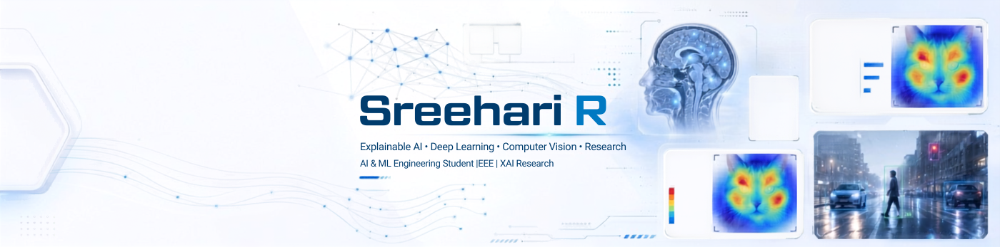

### AI Researcher · Systems Builder
**Mechanistic Interpretability · Explainable AI (XAI) · Trustworthy Deep Learning**

---

## 🔬 Research Overview

I am an AI researcher and undergraduate student in **Artificial Intelligence & Machine Learning** (2023–2027) at Sree Buddha College of Engineering. My research centers on **reverse-engineering deep learning representations**, developing **mathematically grounded and faithful explainability metrics**, and building **trustworthy vision-language and multimodal architectures** for high-stakes domains such as medical diagnostics.

Alongside academic research, I co-founded **R3CTR** and build high-impact platforms including **[PaperLab](https://paperlab.r3actr.work/)** (scholarly discovery and analysis) and **[KTU Hub](https://ktuhub.site/)**.

> *"Building systems that are not only performant, but mathematically interpretable, certifiably faithful, and robust under distribution shifts."*

---

## 🧭 Core Research Directions

<table>
<tr>
<td width="33%" valign="top">

### 🔍 Mechanistic Interpretability
- Dissecting internal representation dynamics and attention flow in **Vision Transformers (ViTs)**.
- Circuit discovery, polysemanticity probing, and feature attribution across deep multi-head layers.

</td>
<td width="33%" valign="top">

### 🩺 Faithful & Medical XAI
- Designing quantitative faithfulness metrics to mitigate hallucinated saliency in clinical AI.
- Adaptive attribution frameworks combining **EVA-02 & Deformable CNNs** for MRI brain tumor diagnostics.

</td>
<td width="33%" valign="top">

### ⚖️ Uncertainty & Robustness
- **Cross-reasoning disagreement analysis (CRDA)** for epistemic uncertainty quantification.
- Out-of-distribution detection and failure-mode prediction in multimodal fusion pipelines.

</td>
</tr>
</table>

---

## 📄 Selected Publications & Manuscripts

<table>
<thead>
<tr>
<th align="left">Publication / Manuscript</th>
<th align="center" width="20%">Status & Venue</th>
<th align="center" width="18%">Artifacts & Citation</th>
</tr>
</thead>
<tbody>
<tr>
<td>

**Boosted Vision Transformer Ensembles for Automatic Detection of Laryngeal and Neurological Voice Disorders**  
***R. Sreehari***, *R. Abhinav, V. S. Kalidas, N. Sukumaran, R. Rajan, M. S. Chinchu*  
Investigates enhanced vision transformer ensembles (DinoV3, EVA-02, MaxViT) with Boosted Weighted Voting and Temperature Scaling calibration on acoustic mel-spectrogram representations, reaching 86.84% accuracy across six vocal pathologies.  
`Keywords`: *Vision Transformers (DinoV3, EVA-02, MaxViT) · Voice Pathology · Boosted Ensembles · Temperature Scaling · Acoustic Diagnostics*

</td>
<td align="center">

🌟 **Published Article**  
*Neural Computing and Applications*  
**(Springer)** · Vol. 38, 707 (2026)

</td>
<td align="center">

  
  

</td>
</tr>

<tr>
<td>

**ADA-XAI: Adaptive Faithfulness-Driven Explainability for Brain Tumor Diagnosis**  
***Sreehari R.***, *et al.*  
Proposed an adaptive, faithfulness-driven explainability framework integrating hybrid EVA-02 representations with deformable convolutional backbones for robust MRI tumor localization.  
`Keywords`: *Explainable AI (XAI) · Vision Transformers · Deformable CNNs · Faithfulness Metrics · Brain Tumor MRI*

</td>
<td align="center">

🏆 **Best Paper Award**  
*ICITIIT '26*  
IIIT Kottayam

</td>
<td align="center">

  

</td>
</tr>

<tr>
<td>

**CRDA: Cross-Reasoning Disagreement Analysis for Uncertainty Quantification in Hybrid Voice Classification**  
***Sreehari R.***, *et al.*  
Introduces disagreement analysis across dual reasoning branches to model epistemic confidence and calibrate predictive reliability in acoustic classification models.  
`Keywords`: *Uncertainty Quantification · Disagreement Analysis · Epistemic Confidence · Voice Classification*

</td>
<td align="center">

✅ **Accepted**  
*2026*

</td>
<td align="center">

</td>
</tr>
</tbody>
</table>

---

## 🛠️ Research & Engineering Toolkit

### Deep Learning & Scientific Computing

### Core Languages & Systems

### Applied Engineering & Interface Platforms

---

## 🚀 Translational Platforms & Initiatives

- 🏛️ **[PaperLab](https://paperlab.r3actr.work/)**: An intelligent platform dedicated to scholarly discovery, structured paper comprehension, and experimental tracking for machine learning researchers.
- 🎓 **[KTU Hub](https://ktuhub.site/)**: Academic and technical portal serving thousands of engineering students under APJ Abdul Kalam Technological University.
- ⚡ **R3CTR**: Co-Founder — an engineering & research collective turning applied intelligence concepts into production software.

---

## 📊 Activity & Telemetry

---

## 🤝 Academic Inquiries & Collaborations

I am actively open to:
- **Research Collaborations**: Mechanistic interpretability, ViT attention analysis, and clinical XAI benchmarks.
- **Reading Groups & Seminars**: Discussions on recent advances in trustworthy ML and model transparency.
- **Applied AI Initiatives**: Bridging deep learning research into robust clinical or open-source software.

📫 Feel free to reach out via **[LinkedIn](https://www.linkedin.com/in/sree14hari/)** or email me directly at **[sreehari@r3actr.work](mailto:sreehari@r3actr.work)**.

Curated with precision · © 2026 Sreehari R

