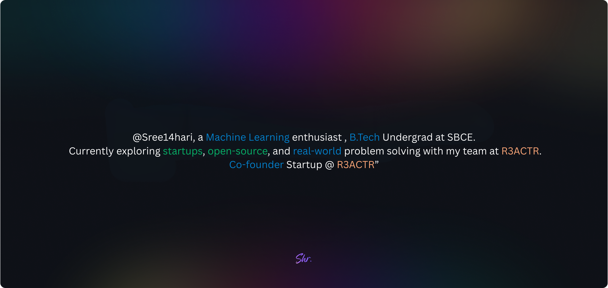

### AI Researcher · Mechanistic Interpretability • Explainable AI • Trustworthy AI

---

## 👋 About Me

- 🎓 B.Tech in **Artificial Intelligence & Machine Learning**, Sree Buddha College of Engineering, Pattoor (2023–2027)
- 🔬 Researching **Vision Transformers, Explainable AI (XAI), and multimodal fusion architectures**
- 🏆 **Best Paper Award — ICITIIT'26, IIIT Kottayam** (ADA-XAI: Adaptive Faithfulness-Driven Explainability for Brain Tumor Diagnosis)
- 🚀 Founder of **R3CTR**, creator of **[KTU Hub](https://ktuhub.site/)** and **[PaperLab](https://paperlab.r3actr.work/)**
- 💬 Ask me about Interpretability for ViTs, hybrid frameworks, or multimodal fusion pipelines

---

## 🧪 Featured Research

<table>
<tr>
<td width="50%">

**ADA-XAI: Adaptive XAI**
`published` · 08.2025–03.2026
Faithfulness-driven explainability for hybrid EVA-02 + deformable CNNs in brain tumor diagnosis.
[Repo](https://github.com/Sree14hari/ADA-XAI-MRI.git)

</td>
<td width="50%">
**CRDA: Cross-Reasoning Disagreement Analysis for Uncertainty Quantification in Hybrid Voice Classification**
`accepted` · 2026–Present

</td>

</tr>
</table>

---

## 🛠️ Tech Stack

**Languages**

**Frameworks & Runtimes**

**AI-Assisted Dev & Tools**

**Cloud & Deployment**

**Design**

---

## 📊 GitHub Stats

---

📫 Reach me on **[LinkedIn](https://www.linkedin.com/in/sree14hari/)** or through **[my portfolio](https://www.sree14hari.me/)**

💫 From **[Sreehari R](https://github.com/Sree14hari)** with ❤️

